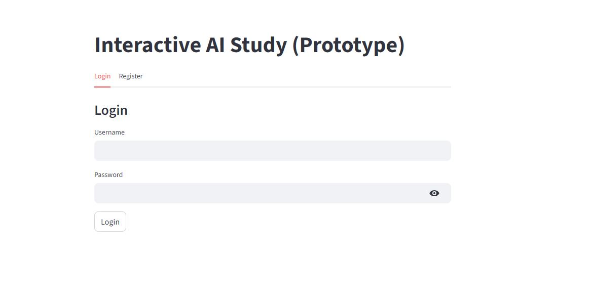
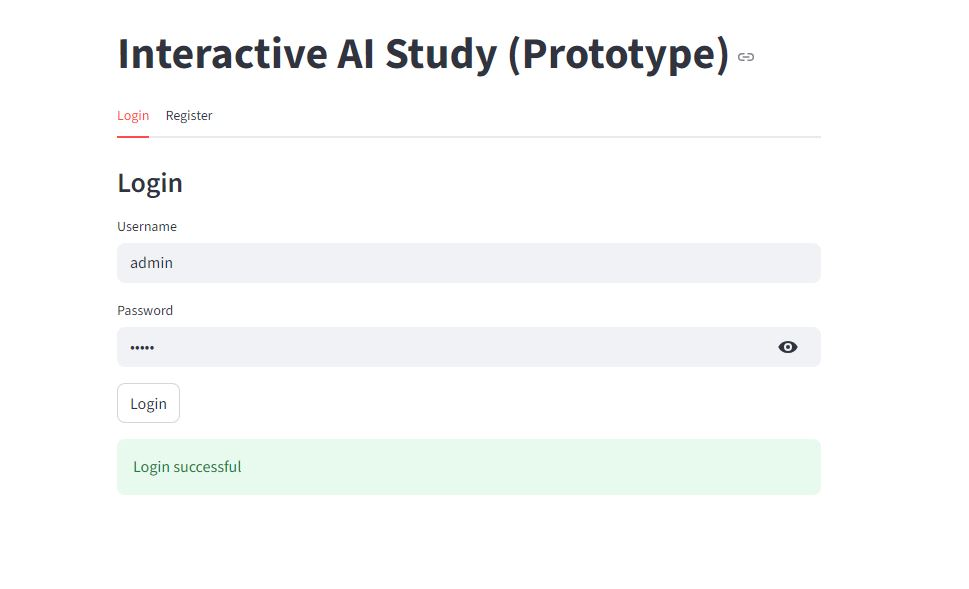
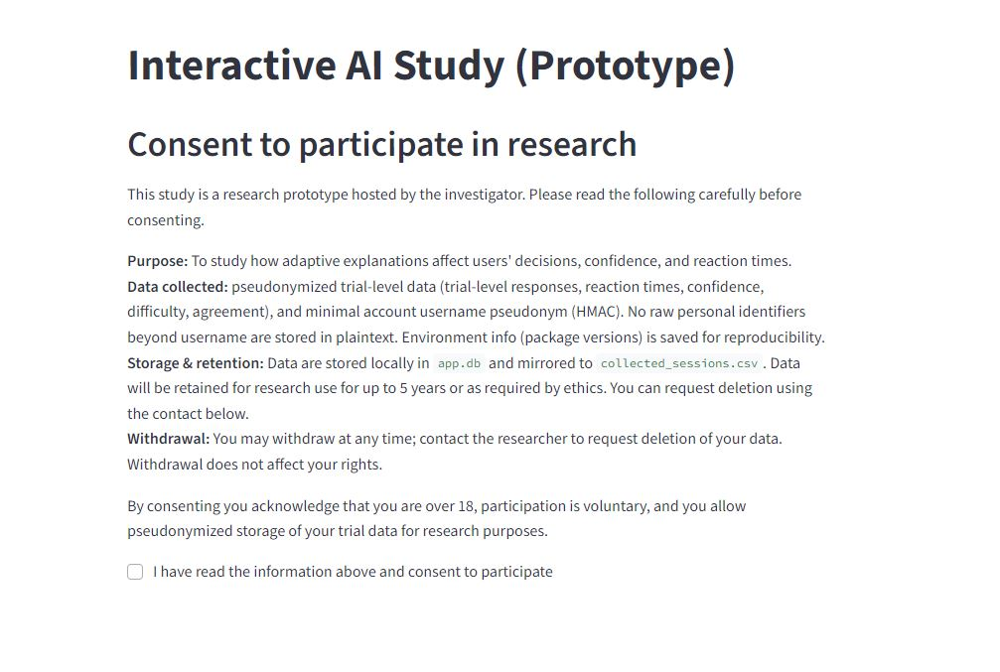
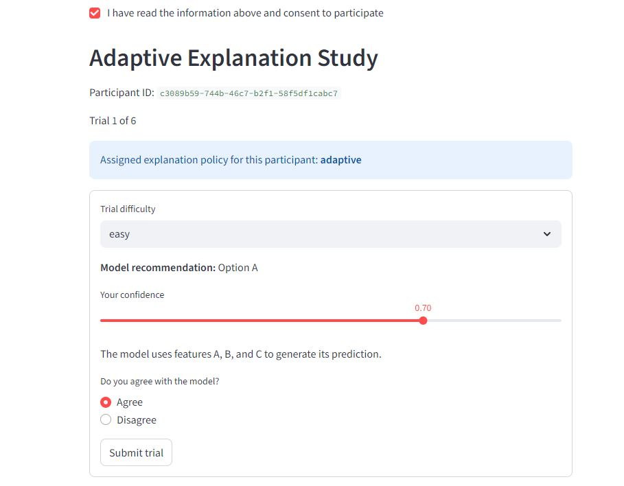
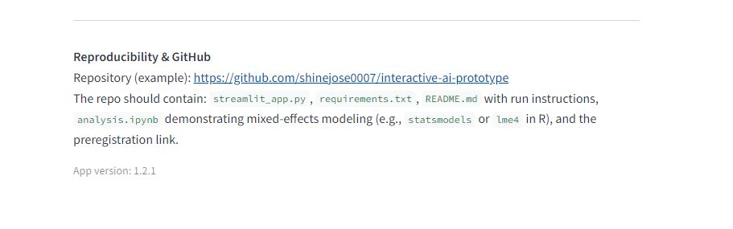
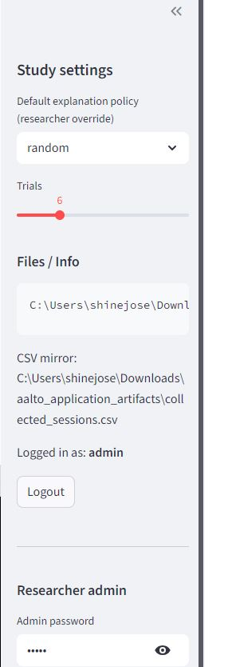
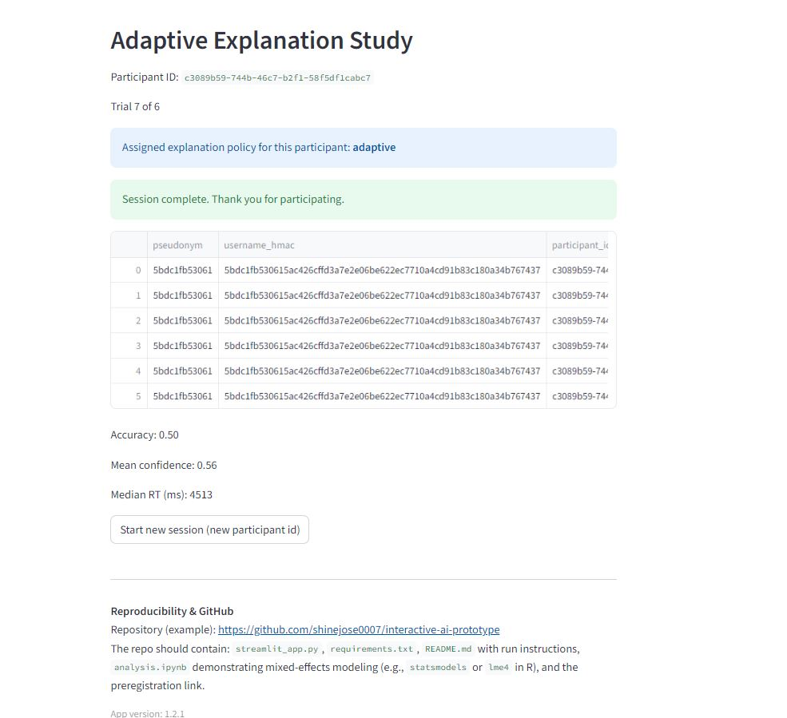

This repository contains application artifacts prepared for a Doctoral Researcher position in interactive AI (Aalto, Engineering Psychology Group).

## Contents
- `research_fit.md` — one-page mapping of your projects to the group's interests and a 1st-year project idea.
- `sim_user_study.csv` — simulated pilot dataset for a between-subjects static vs adaptive explanation pilot.
- `analysis_notebook.ipynb` — notebook with descriptive stats, t-tests and visualisations (matplotlib).
- `short_report.md` — short report summarising the pilot.
- `streamlit_app.py` — lightweight Streamlit prototype demonstrating an adaptive explanation policy.
- `LICENSE` — recommended MIT license (add when publishing).

## How to publish to GitHub (recommended steps)
1. Create a new GitHub repository, e.g. `aalto-phd-adaptive-explanations`.
2. Place these files at the repo root. Add a `requirements.txt` containing:
```
streamlit
pandas
numpy
matplotlib
scipy
```
3. Add a `LICENSE` (MIT recommended) and `README.md` (this file).
4. Commit and push:
```bash
git init
git add .
git commit -m "Initial application artifacts: research fit, pilot dataset, analysis notebook, Streamlit prototype"
git branch -M main
git remote add origin https://github.com/<your-username>/aalto-phd-adaptive-explanations.git
git push -u origin main
```
Outputs

<p align="center"></p>
<p align="center"></p>
<p align="center"></p>
<p align="center"></p>
<p align="center"></p>
<p align="center"></p>
<p align="center"></p>


**Author:** Shine Jose
**License:** MIT (see LICENSE file)

This repository is provided as sample educational content by Shine Jose..... Use and modify freely.........
